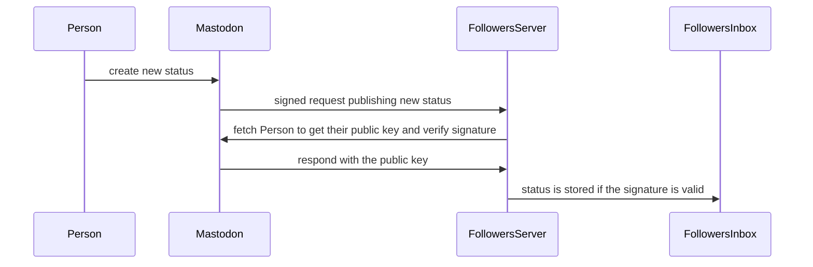

# Signing behaviour

Mastodon has extended the ActivityPub objects to include a PublicKey. This is to enable it to sign the requests used to
distribute status updates out to followers.



## How is the signature created

Mastodon selects particular elements from the request and builds a signature for those using the key for the `Person`
(Actor in Mastodon documentation) originating the status.

HTTP header looks like: -
```
Signature: keyId="https://my.example.com/actor#main-key",headers="(request-target) host date",signature="Y2FiYW...IxNGRiZDk4ZA=="
```
The three parts in this signature are:-
 * keyId - URL to the public key of the Person
 * headers - The headers used as source data for the signature
 * signature - The signature computed using the private key of the Person

